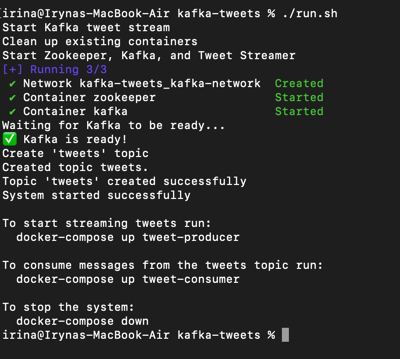
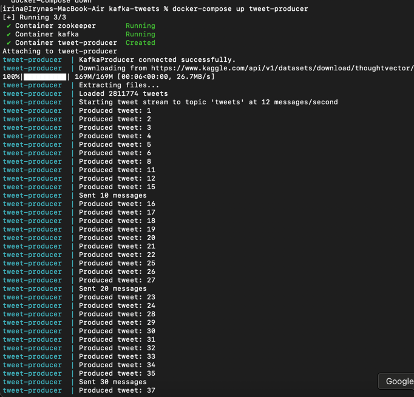
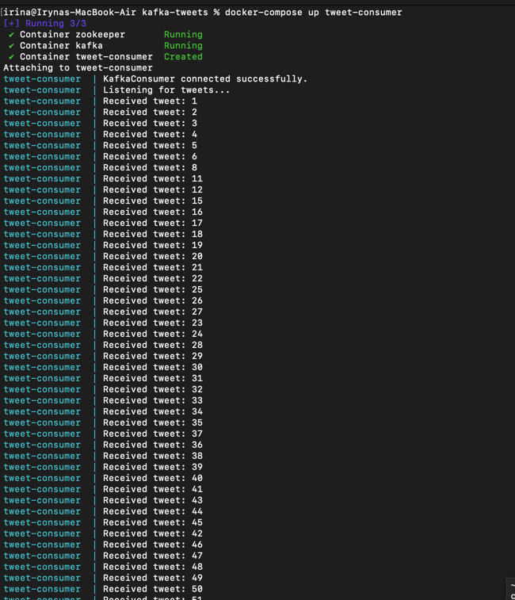

# Kafka Tweet Stream System

A system that simulates a Twitter stream by reading tweets from a dataset and
sending them to Apache Kafka at a controlled rate of 12 messages per second.

## System Components

- **Zookeeper**: Coordination service for Kafka
- **Kafka**: Message broker for handling tweet streams  
- **Tweet Producer**: Python application that reads tweets and streams them to Kafka
- **Tweet Consumer**: Python application to verify message delivery

## Start

### 1. Build the System
```bash
chmod +x *.sh
./build.sh
```

### 2. Start Kafka and Zookeeper
```bash
./run.sh
```

### 3. Start producing and receiving tweets
```bash
# View live producer logs
docker-compose up tweet-producer

# View live consumer logs
docker-compose up tweet-consumer
```

### 4. Stop the System
```bash
docker-compose down
```

### 5. Screenshots

* Start Kafka and Zookeeper

* Start Tweet Producer

* Start Tweet Consumer
